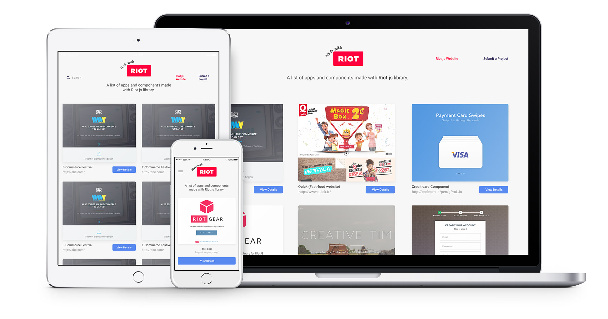

# Made With Riot



Made With Riot is a public showcase for websites, webapps and components made using Riot.js library.

## Adding a project to Made With Riot

1. Fork this repository;
2. Add your image (748x600) on `/resources`. E.g. `project-nike-store.jpg`;
3. Add your project info on `/src/data/project.json`;
4. Submit a pull-request.

If you have any trouble doing it, check pull requests to see others' submits.

## Working locally

To run the project, follow the steps bellow after cloning the repository:

```bash
npm install
gulp compile:all #or npm run compile
gulp lift #or npm run lift
```

Then access the application on http://localhost:8000/

### Development

For developing, simply run the command `gulp watch:all` for automatic re-compiling on file changes.

For anyone interested, these are the technologies used for this project:

**JavaScript Libraries used:**

- Riot;
- Good ol' Vanilla JavaScript.


**CSS Tools used:**

- Sass


**Task Runner:**

- Gulp


### Deploying on gh-pages

To deploy on production simply run the following tasks on your local environment

```bash
gulp compile:all #or npm run compile
gulp deploy #or npm run deploy
```

Then follow the instructions on your terminal.
